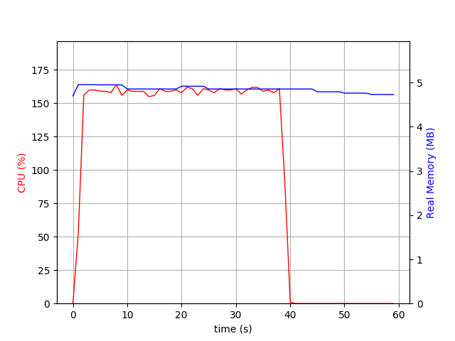
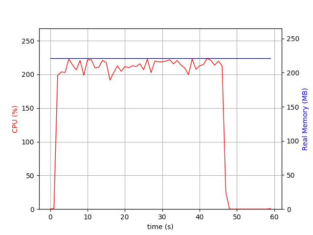
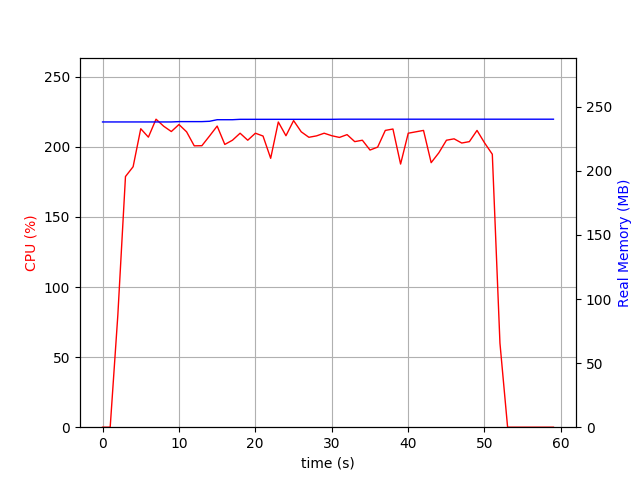
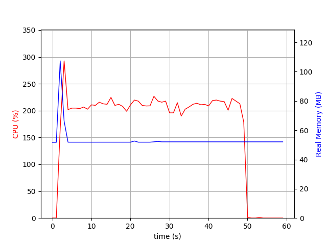
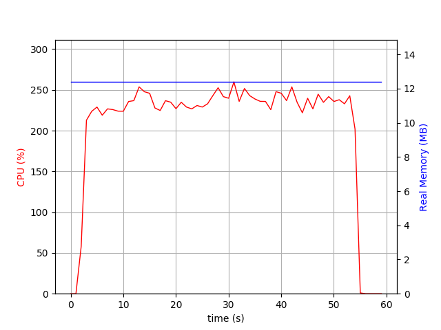

# Just for fun
Benchmarking the simple "Hello, World!" web apps with different web frameworks using different platforms.
Just a check up on how the things changed since the [last check up](https://github.com/smecsia/webfw-benchmarks), which I did 2 years ago.
Also it was interesting what you can achieve with the new JDK things like module system and also with the new IBM's OpenJ9 JRE.
So the source code contain only simple Java project with Undertow as a web framework (as it was the most performant one according 
to the previous tests).

## Hardware configuration

Tests have been performed on my laptop: 

MacBookPro11,5 (Intel(R) Core(TM) i7-4870HQ CPU @ 2.50GHz 16GB RAM)

## Software configuration

Ubuntu 16.04.4 Linux 4.4.0-112-generic

* Oracle JDK 9-ea+181 for miniJRE
* Oracle JDK 9.0.4+11
* Go 1.10.1
* Crystal 0.24.2
* Undertow 2.7.Final
* Kemal [c2236ac](https://github.com/sdogruyol/kemal/commit/c2236acf3a630e844928edd607699e8738992a5c)
* Gin [bf78038](https://github.com/gin-gonic/gin/commit/bf7803815b0baa22ff7a10457932882dfbf09925)

### Notes

* All apps were running inside Docker containers with `--net host` option.
* [Moditect](https://github.com/moditect/moditect) was used to produce the jlinked JRE with the app
* Static linking was used for Crystal and Golang (`--release --static` for Crystal, `CGO_ENABLED=1` for Golang).

## Benchmarking tool

Apache Benchmark running with the following command:

    $ ab -c 10 -n 1000000 http://localhost:8080/

So making 1M requests with the concurrency 10.

## Results:

| Framework                    | Base image                       | img size | RPS   |  Time (s) |  Avg (ms) | Mem max (mb) | Mem min (mb) | CPU max (%) |
| :--------------------------- | -------------------------------: | -------: | ----: | --------: | --------: | -----------: | -----------: | ----------: |
| Crystal 0.24.2 Kemal(master) | frolvlad/alpine-glibc:alpine-3.7 | 17Mb     | 26358 |  37.938   | 0.038     | 5            | 4.7          | 160         | 
| Oracle miniJRE9 Undertow 2.7 | frolvlad/alpine-glibc:alpine-3.7 | 50Mb     | 22175 |  45.094   | 0.045     | 225          | 225          | 225         | 
| OpenJ9 JRE9 Undertow 2.7     | xlate/openj9:latest              | 265Mb    | 21054 |  47.495   | 0.017     | 110          | 55           | 295         | 
| Oracle JRE9 Undertow 2.7     | sgrio/java-oracle:jre_9          | 380Mb    | 20087 |  49.782   | 0.050     | 240          | 230          | 220         |
| Golang 1.10.1 Gin(master)    | frolvlad/alpine-glibc:alpine-3.7 | 22Mb     | 19161 |  52.188   | 0.026     | 13           | 13           | 260         | 

## Conclusions

* Crystal appears to be the best from all perspectives (which is amazing). Also it reveals the artificial nature of the tests, because Crystal does not 
support multi-threading at the moment (though it works with the async model using fibers, it utilises 2 CPU cores at most - GC runs in a separate thread). 
So most likely these benchmarks are useless for anything real :). 
* Cool thing about new JDK is that you can build a container image having only 50Mb in size out of your Java app (which is still more than 2x times more than
with Crystal or Golang, but it is 3-6 times less than it used to be before Java9).
* OpenJ9 manages memory more aggressively comparing to Oracle JRE, as a result you get 3-4 times less memory consumption in average. 

### Crystal 0.24.2 with Kemal

    Document Path:          /
    Document Length:        12 bytes

    Concurrency Level:      10
    Time taken for tests:   37.938 seconds
    Complete requests:      1000000
    Failed requests:        0
    Total transferred:      97000000 bytes
    HTML transferred:       12000000 bytes
    Requests per second:    26358.89 [#/sec] (mean)
    Time per request:       0.379 [ms] (mean)
    Time per request:       0.038 [ms] (mean, across all concurrent requests)
    Transfer rate:          2496.89 [Kbytes/sec] received

    Connection Times (ms)
                  min  mean[+/-sd] median   max
    Connect:        0    0   0.1      0       2
    Processing:     0    0   0.1      0       4
    Waiting:        0    0   0.1      0       4
    Total:          0    0   0.1      0       4

    Percentage of the requests served within a certain time (ms)
      50%      0
      66%      0
      75%      0
      80%      0
      90%      1
      95%      1
      98%      1
      99%      1
     100%      4 (longest request)

### Oracle miniJRE9 with Undertow 2.7

    Document Path:          /
    Document Length:        11 bytes

    Concurrency Level:      10
    Time taken for tests:   47.301 seconds
    Complete requests:      1000000
    Failed requests:        0
    Total transferred:      132000000 bytes
    HTML transferred:       11000000 bytes
    Requests per second:    21140.98 [#/sec] (mean)
    Time per request:       0.473 [ms] (mean)
    Time per request:       0.047 [ms] (mean, across all concurrent requests)
    Transfer rate:          2725.20 [Kbytes/sec] received

    Connection Times (ms)
                  min  mean[+/-sd] median   max
    Connect:        0    0   0.1      0       2
    Processing:     0    0   0.1      0       5
    Waiting:        0    0   0.1      0       5
    Total:          0    0   0.2      0       5

    Percentage of the requests served within a certain time (ms)
      50%      0
      66%      0
      75%      1
      80%      1
      90%      1
      95%      1
      98%      1
      99%      1
     100%      5 (longest request)

### Oracle JRE9 with Undertow 2.7

    Document Path:          /
    Document Length:        11 bytes

    Concurrency Level:      10
    Time taken for tests:   49.782 seconds
    Complete requests:      1000000
    Failed requests:        0
    Total transferred:      132000000 bytes
    HTML transferred:       11000000 bytes
    Requests per second:    20087.44 [#/sec] (mean)
    Time per request:       0.498 [ms] (mean)
    Time per request:       0.050 [ms] (mean, across all concurrent requests)
    Transfer rate:          2589.40 [Kbytes/sec] received

    Connection Times (ms)
                  min  mean[+/-sd] median   max
    Connect:        0    0   0.1      0       5
    Processing:     0    0   0.1      0      10
    Waiting:        0    0   0.1      0       9
    Total:          0    0   0.2      0      10

    Percentage of the requests served within a certain time (ms)
      50%      0
      66%      1
      75%      1
      80%      1
      90%      1
      95%      1
      98%      1
      99%      1
     100%     10 (longest request)

     
## OpenJ9 JRE with Undertow 2.7

    Server Hostname:        localhost
    Server Port:            8080

    Document Path:          /
    Document Length:        11 bytes

    Concurrency Level:      10
    Time taken for tests:   47.495 seconds
    Complete requests:      1000000
    Failed requests:        0
    Total transferred:      132000000 bytes
    HTML transferred:       11000000 bytes
    Requests per second:    21054.79 [#/sec] (mean)
    Time per request:       0.475 [ms] (mean)
    Time per request:       0.047 [ms] (mean, across all concurrent requests)
    Transfer rate:          2714.09 [Kbytes/sec] received

    Connection Times (ms)
                  min  mean[+/-sd] median   max
    Connect:        0    0   0.1      0       6
    Processing:     0    0   0.1      0       6
    Waiting:        0    0   0.1      0       6
    Total:          0    0   0.2      0       6

    Percentage of the requests served within a certain time (ms)
      50%      0
      66%      0
      75%      1
      80%      1
      90%      1
      95%      1
      98%      1
      99%      1
     100%      6 (longest request)
     

## Go 1.10.1 with Gin

    Document Path:          /
    Document Length:        13 bytes

    Concurrency Level:      10
    Time taken for tests:   52.188 seconds
    Complete requests:      1000000
    Failed requests:        0
    Total transferred:      130000000 bytes
    HTML transferred:       13000000 bytes
    Requests per second:    19161.64 [#/sec] (mean)
    Time per request:       0.522 [ms] (mean)
    Time per request:       0.052 [ms] (mean, across all concurrent requests)
    Transfer rate:          2432.63 [Kbytes/sec] received

    Connection Times (ms)
              min  mean[+/-sd] median   max
    Connect:        0    0   0.1      0       4
    Processing:     0    0   0.1      0      10
    Waiting:        0    0   0.1      0       7
    Total:          0    1   0.2      0      10
    ERROR: The median and mean for the total time are more than twice the standard
       deviation apart. These results are NOT reliable.

    Percentage of the requests served within a certain time (ms)
    50%      0
    66%      1
    75%      1
    80%      1
    90%      1
    95%      1
    98%      1
    99%      1
    100%     10 (longest request)

     
